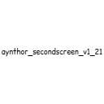

# AYN Thor Second Screen

**Minecraft's HUD, moved to the AYN Thor's bottom screen.**

This Fabric mod hides the vanilla HUD and streams what it was drawing — health,
hunger, armor, breath, XP, the hotbar, a live map, your open inventory and chat —
to a companion Android app running on the same device, which draws it all on the
second display using the game's own textures.

The top screen becomes all game. The bottom screen becomes the interface.

| | |
|---|---|
| **This repo** | the Fabric mod that runs inside Minecraft |
| **Companion app** | [Android_AynThor_MinecraftSecondScreen](https://github.com/exojosh/Android_AynThor_MinecraftSecondScreen) |

You need **both**. They talk to each other over a loopback socket
(`127.0.0.1:48291`) and neither does anything on its own.

## What you get on the bottom screen

- **HUD** — hearts (including absorption, poison, wither, freezing and hardcore
  variants), hunger, armor, breathing bubbles, the XP bar and level, the hotbar
  with stack counts, durability bars and an animated enchantment glint, plus the
  off-hand slot under your thumb. Tap a slot to select it.
- **Map** — a live map of where you are, drawn on vanilla's paper sheet.
- **Items** — your inventory, or whatever container is open. Tap or drag to move
  items, in `Stack` / `Half` / `Single` / `Move` (shift-click) modes; hold still
  then drag to spread a stack across slots, exactly as dragging does in game.
- **Chat** — the game's chat log in Minecraft's own font, with a keyboard to
  answer it (the app's own, or Android's — your choice in Settings).
- **Input** — nine buttons, each bound to any key binding the game has, yours or
  another mod's.
- **Settings** — turn any HUD element off and the *game* draws it again on the
  top screen, so between the two displays the HUD is always drawn exactly once.

Every texture comes from Minecraft itself over the socket, so **your resource
pack applies to the second screen too**, with nothing to copy anywhere.

## Requirements

- An **AYN Thor**, or any Android device that reports a second
  presentation-category display.
- **[Zalith Launcher 2](https://github.com/ZalithLauncher/ZalithLauncher2)** (or
  another PojavLauncher-based launcher).
- **Minecraft 1.21.11**
- **Fabric Loader 0.19.3** or newer
- **[Fabric API](https://modrinth.com/mod/fabric-api)** for 1.21.11 — this mod
  will not load without it.

## Install

### 1. The mod, in Zalith Launcher 2

1. Download **`aynthor_secondscreen_v1_21-1.0.0.jar`** from
   [Releases](https://github.com/exojosh/AynThorSecondScreen/releases), and
   **Fabric API** for 1.21.11 from
   [Modrinth](https://modrinth.com/mod/fabric-api/versions?g=1.21.11).
2. In ZL2, create or select a version: pick **1.21.11**, then add
   **Fabric 0.19.3**.
3. Open that version's **gear icon** → **Mods**.
4. Tap **+ / Import**, and add the **Fabric API** jar.
5. Tap **+ / Import** again, and add
   **`aynthor_secondscreen_v1_21-1.0.0.jar`**.
6. Both should now be listed and enabled.

> **Import the right file.** The release is one jar on purpose — the only file
> in `build/libs` is the one you want. If you built it yourself, ignore
> `build/devlibs/`.

### 2. The companion app

Install the APK from the
[companion app's releases](https://github.com/exojosh/Android_AynThor_MinecraftSecondScreen/releases),
or build it yourself:

```
git clone https://github.com/exojosh/Android_AynThor_MinecraftSecondScreen
cd Android_AynThor_MinecraftSecondScreen
./gradlew installDebug
```

It needs no permissions and no setup. There is nothing to configure, no folder
to grant, and no game files to copy.

### 3. Run it

1. **Launch the app.** On the Thor it paints the bottom screen and waits; on a
   single-screen device it shows a status page instead, which is the expected
   fallback.
2. **Launch Minecraft from ZL2** and load a world.
3. The vanilla HUD disappears from the top screen and appears on the bottom one.

Either order works — the app reconnects on its own, and survives the game being
restarted under it.

## Troubleshooting

| What you see | What it is |
|---|---|
| App says **Not connected** | Minecraft isn't running, or the mod didn't load. Check ZL2's mod list, and that Fabric API is installed. |
| **Port 48291 is taken by something else** | Usually a leftover `adb reverse tcp:48291 tcp:48291` from a dev session — adbd holds the port. Run `adb reverse --remove-all`. |
| Second screen never appears, app fills the top screen | No presentation-category display was found. Expected on phones and emulators; on the Thor, check the second screen isn't disabled in system settings. |
| HUD draws, but item icons are missing or the buttons look plain | The mod jar is older than the app (or the other way round). Both halves of a release are meant to be used together. |
| HUD drawn **twice**, on both screens | An element was switched off on the second screen and handed back to the game — that's the feature. Settings → *Show on this screen*. |
| Chat keyboard covers the game instead of the bottom screen | Settings → Chat → turn *Use the Android keyboard* off; the app draws its own, which always lands on the right screen. |

## Building from source

Requires **JDK 21**.

```
./gradlew build          # -> build/libs/aynthor_secondscreen_v1_21-1.0.0.jar
./gradlew runClient      # a dev client with the mod loaded
```

Smoke-test the protocol with no app and no device — run a client, join a world,
and from another terminal:

```
nc localhost 48291
```

You should see one JSON line per change. `tools/capture_protocol.py` does the
same thing and writes every message type to disk.

`tools/make_icon.py` regenerates the mod icon (needs Pillow).

## License

[CC0-1.0](LICENSE) — public domain. Use it, fork it, ship it.

Minecraft textures are **not** redistributed by either half of this project:
the mod reads them from your own installation at runtime and hands them to the
app over the socket.
